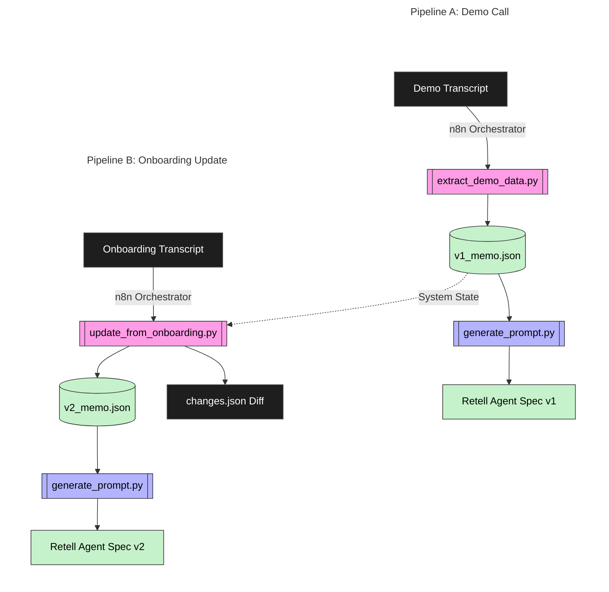
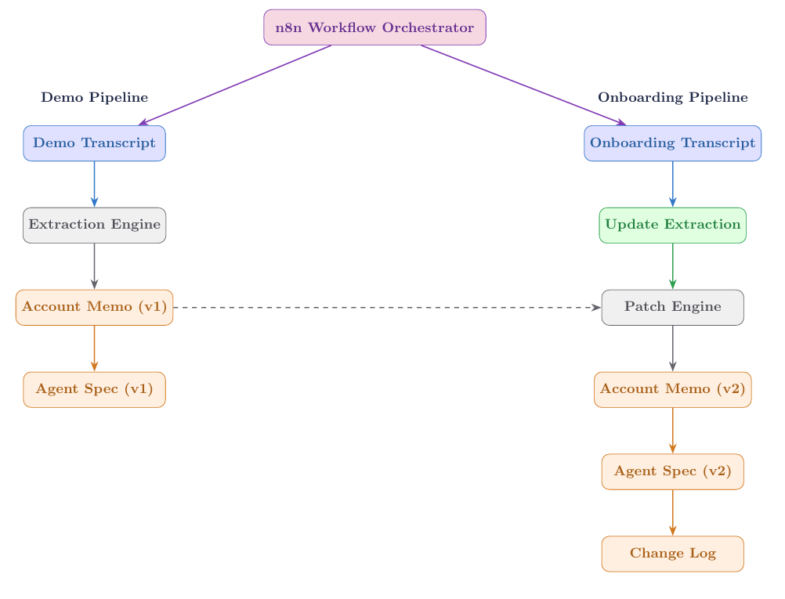
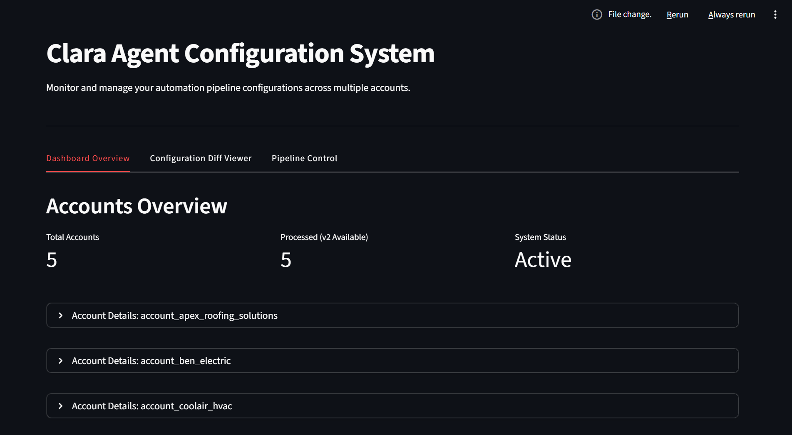
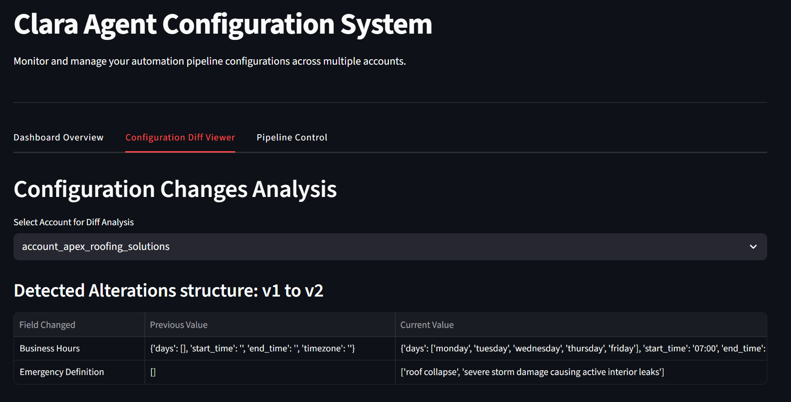
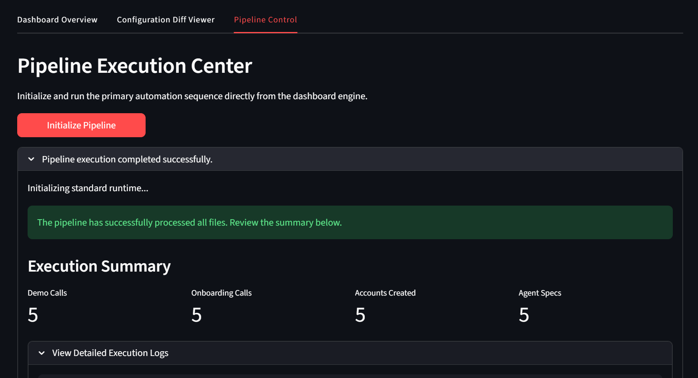

<div align="center">

# 🤖 Clara Agent Configuration Automation Pipeline

**An automation pipeline that converts service trade demo and onboarding conversations into structured AI voice agent configurations.**

[](https://www.python.org/)
[](https://n8n.io/)
[](https://streamlit.io/)

</div>

---

<h2 align="center">📋 Overview</h2>

Service trade businesses often describe their operations during demo and onboarding calls. These conversations include critical operational information such as business hours, emergency handling rules, supported services, and call routing instructions.

This project implements an automation pipeline that converts those conversations into **structured AI voice agent configurations** that can be deployed in Clara.

### The system processes transcripts and produces:
- 🗂️ **Structured operational account data**
- 🤖 **Versioned Clara agent specifications**
- 📝 **Configuration change tracking**
- ⚡ **Batch automation for multiple accounts**

> Automation is orchestrated using **n8n**, while the processing logic is implemented in **Python**.

---

<h2 align="center">⚙️ System Workflow</h2>

The pipeline converts conversational input into deployable agent configuration.

<div align="center">



</div>

---

<h2 align="center">🏗️ Phase 1 — Schema Design</h2>

The system starts by defining schemas that convert conversations into structured configuration.

### 📄 Account Memo Schema
Stores operational information extracted from conversations.

<details>
<summary><b>View Example</b></summary>

```json
{
  "account_id": "account_ben_electric",
  "company_name": "Ben Electric",
  "services_supported": ["panel upgrades", "electrical repair"],
  "business_hours": {
    "days": ["monday", "tuesday", "wednesday", "thursday", "friday"],
    "start_time": "08:00",
    "end_time": "17:00",
    "timezone": "MST"
  }
}
```
</details>

### 🤖 Agent Specification Schema
Defines the Clara voice agent configuration.

<details>
<summary><b>View Example</b></summary>

```json
{
  "agent_name": "Ben Electric Voice Assistant",
  "voice_style": "professional",
  "version": "v1"
}
```
</details>

### 📝 Change Log Schema
Tracks configuration updates during onboarding.

<details>
<summary><b>View Example</b></summary>

```json
{
  "field": "business_hours.start_time",
  "old_value": "",
  "new_value": "08:00"
}
```
</details>

---

<h2 align="center">🔄 Phase 2 — n8n Workflow Orchestration</h2>

Automation is triggered using an n8n workflow.

<div align="center">
  
</div>

---

<h2 align="center">🎙️ Phase 3 — Demo Transcript Extraction</h2>

Demo call transcripts are processed to generate a structured account configuration.

**Example transcript input:**
> *"Client mentioned they handle electrical repairs, EV charger installation and panel upgrades."*

**Execution:**
```bash
# Script: scripts/extract_demo_data.py
python scripts/extract_demo_data.py
```

**Output:**
```text
outputs/accounts/account_ben_electric/v1/memo.json
```

---

<h2 align="center">🧠 Phase 4 — Agent Prompt Generation</h2>

Using the extracted account memo, the system generates a Clara voice agent configuration.

**Execution:**
```bash
# Script: scripts/generate_prompt.py
python scripts/generate_prompt.py
```

**Output:**
```text
outputs/accounts/account_ben_electric/v1/agent_spec.json
```

<details>
<summary><b>View Example Generated Agent Configuration</b></summary>

```json
{
  "agent_name": "Ben Electric Voice Assistant",
  "voice_style": "professional",
  "version": "v1"
}
```
</details>

---

<h2 align="center">📈 Phase 5 — Onboarding Update Engine</h2>

When onboarding conversations provide new operational information, the pipeline updates the existing configuration.

**Example onboarding transcript:**
> *"Business hours confirmed as Monday to Friday 8AM to 5PM. Emergency calls include power outages."*

**Execution:**
```bash
# Script: scripts/update_from_onboarding.py
python scripts/update_from_onboarding.py
```

**Output:**
```text
outputs/accounts/account_ben_electric/v2/memo.json
outputs/accounts/account_ben_electric/v2/agent_spec.json
```

---

<h2 align="center">🗂️ Phase 6 — Configuration Versioning</h2>

The system preserves configuration history. Version 1 represents the configuration generated from the demo call, while Version 2 includes updates confirmed during onboarding.

```text
outputs/accounts/account_ben_electric/
├── v1/
│   ├── memo.json
│   └── agent_spec.json
├── v2/
│   ├── memo.json
│   └── agent_spec.json
└── changes.json
```

---

<h2 align="center">🔍 Phase 7 — Change Tracking</h2>

Every configuration update is recorded. This allows the system to maintain a full configuration history.

**Log File:** `outputs/accounts/account_ben_electric/changes.json`

<details>
<summary><b>View Example Log</b></summary>

```json
{
  "field": "business_hours.start_time",
  "old_value": "",
  "new_value": "08:00",
  "reason": "Updated during onboarding"
}
```
</details>

---

<h2 align="center">⚡ Phase 8 — Batch Processing</h2>

The pipeline processes multiple accounts automatically.

**Dataset folders:**
```text
dataset/demo_calls/
dataset/onboarding_calls/
```

**Run the full pipeline:**
```bash
python main.py
```

**The pipeline automatically:**
1. Extracts demo information
2. Generates agent configurations
3. Applies onboarding updates
4. Logs configuration changes

---

<h2 align="center">🗄️ Database Integration</h2>

The system can optionally mirror configuration data into **Supabase**. This simulates how the pipeline would operate in a production environment.

**Stored entities:**
- `accounts`
- `agent configuration versions`
- `change logs`

---

<h2 align="center">🚀 Running the Project</h2>

### 1. Install Dependencies
```bash
pip install -r requirements.txt
```

### 2. Set Up Environment Variables
Create a `.env` file and add necessary credentials.

### 3. Run the Pipeline
```bash
python main.py
```

### 4. View Changes via Dashboard

I have introduced a beautifully designed Streamlit Dashboard to visually audit the entire pipeline extraction, config diffs, and account states.

```bash
pip install streamlit
streamlit run Dashboard/app.py
```

<div align="center">
  
  <br><br>
  
  <br><br>
  
</div>

<!-- Features included in the Dashboard:
- **Dashboard Overview :** View all extracted agent accounts, contact numbers, and complete V1 and V2 JSON schemas in expandable cards.
- **Configuration Diff Viewer :** Audit exactly what operational fields changed during Onboarding using a clean data table.
- **Pipeline Control :** Run the complete end-to-end `main.py` Python extraction script directly from the UI and view the results. -->

---

<h2 align="center">📞 Retell Integration</h2>

The pipeline generates a Retell-compatible agent configuration specification.

**Output file:** `outputs/accounts/<account_id>/v1/agent_spec.json`

These files contain the information required to configure a Clara voice agent including:
- Agent name
- System prompt
- Voice style
- Operational variables
- Call transfer logic
- Fallback behavior

<details>
<summary><b>View Example Agent Specification</b></summary>

```json
{
  "agent_name": "Ben Electric Voice Assistant",
  "voice_style": "professional and calm",
  "version": "v2"
}
```
</details>

---

<div align="center">

### ✨ Thank You! ✨

**Thank you for exploring the Clara Agent Configuration Automation Pipeline**

</div>