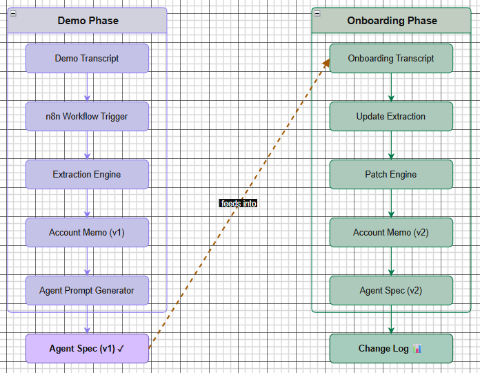

# Clara Agent Configuration Automation Pipeline

## Overview

Service trade businesses often describe their operations during demo and onboarding calls. These conversations include critical operational information such as business hours, emergency handling rules, supported services, and call routing instructions.

This project implements an automation pipeline that converts those conversations into **structured AI voice agent configurations** that can be deployed in Clara.

The system processes demo and onboarding transcripts and produces:

- Structured operational account data
- Versioned Clara agent specifications
- Configuration change tracking
- Batch automation for multiple accounts

Automation is orchestrated using **n8n**, while the processing logic is implemented in Python.

---

## System Workflow

The pipeline converts conversational input into deployable agent configuration.




---

## Phase 1 — Schema Design

The system starts by defining schemas that convert conversations into structured configuration.

### Account Memo Schema

Stores operational information extracted from conversations.

Example:

```json
{
  "account_id": "account_ben_electric",
  "company_name": "Ben Electric",
  "services_supported": ["panel upgrades", "electrical repair"],
  "business_hours": {
    "days": ["monday", "tuesday", "wednesday", "thursday", "friday"],
    "start_time": "08:00",
    "end_time": "17:00",
    "timezone": "MST"
  }
}
```

### Agent Specification Schema

Defines the Clara voice agent configuration.

```json
{
  "agent_name": "Ben Electric Voice Assistant",
  "voice_style": "professional",
  "version": "v1"
}
```

### Change Log Schema

Tracks configuration updates during onboarding.

```json
{
  "field": "business_hours.start_time",
  "old_value": "",
  "new_value": "08:00"
}
```

---

## Phase 2 — n8n Workflow Orchestration

Automation is triggered using an n8n workflow.

Workflow:

```
Manual Trigger
      ↓
Execute Command
      ↓
python main.py
```

Workflow definition:

```
workflows/n8n_pipeline.json
```

This design allows the system to integrate easily into workflow automation environments.

---

## Phase 3 — Demo Transcript Extraction

Demo call transcripts are processed to generate a structured account configuration.

Example transcript input:

```
Client mentioned they handle electrical repairs, EV charger installation and panel upgrades.
```

Extraction script:

```
scripts/extract_demo_data.py
```

Run manually:

```bash
python scripts/extract_demo_data.py
```

Output:

```
outputs/accounts/account_ben_electric/v1/memo.json
```

---

## Phase 4 — Agent Prompt Generation

Using the extracted account memo, the system generates a Clara voice agent configuration.

Script:

```
scripts/generate_prompt.py
```

Run:

```bash
python scripts/generate_prompt.py
```

Output:

```
outputs/accounts/account_ben_electric/v1/agent_spec.json
```

Example generated agent configuration:

```json
{
  "agent_name": "Ben Electric Voice Assistant",
  "voice_style": "professional",
  "version": "v1"
}
```

---

## Phase 5 — Onboarding Update Engine

When onboarding conversations provide new operational information, the pipeline updates the existing configuration.

Example onboarding transcript:

```
Business hours confirmed as Monday to Friday 8AM to 5PM.
Emergency calls include power outages.
```

Script:

```
scripts/update_from_onboarding.py
```

Run:

```bash
python scripts/update_from_onboarding.py
```

Output:

```
outputs/accounts/account_ben_electric/v2/memo.json
outputs/accounts/account_ben_electric/v2/agent_spec.json
```

---

## Phase 6 — Configuration Versioning

The system preserves configuration history.

Example structure:

```
outputs/accounts/account_ben_electric/
├── v1/
│   ├── memo.json
│   └── agent_spec.json
├── v2/
│   ├── memo.json
│   └── agent_spec.json
└── changes.json
```

Version 1 represents the configuration generated from the demo call.

Version 2 includes updates confirmed during onboarding.

---

## Phase 7 — Change Tracking

Every configuration update is recorded.

Example:

```
outputs/accounts/account_ben_electric/changes.json
```

Example log:

```json
{
  "field": "business_hours.start_time",
  "old_value": "",
  "new_value": "08:00",
  "reason": "Updated during onboarding"
}
```

This allows the system to maintain a full configuration history.

---

## Phase 8 — Batch Processing

The pipeline processes multiple accounts automatically.

Dataset folders:

```
dataset/demo_calls/
dataset/onboarding_calls/
```

Run the full pipeline:

```bash
python main.py
```

The pipeline automatically:

- Extracts demo information
- Generates agent configurations
- Applies onboarding updates
- Logs configuration changes

---

## Database Integration

The system can optionally mirror configuration data into Supabase.

Stored entities:

- accounts
- agent configuration versions
- change logs

This simulates how the pipeline would operate in a production environment.

---

## Running the Project

### 1. Install dependencies:

```bash
pip install -r requirements.txt
```

### 2. Set up environment variables:

Copy `.env.example` to `.env` and fill in your Supabase credentials:

```bash
cp .env.example .env
```

### 3. Run the pipeline:

```bash
python main.py
```

Or trigger it through n8n.

### 4. View changes via Dashboard:

We have introduced a beautifully designed Streamlit Dashboard to visually audit the entire pipeline extraction, config diffs, and account states.

```bash
pip install streamlit
streamlit run Dashboard/app.py
```

Features included in the Dashboard:
- **Dashboard Overview (Tab 1):** View all extracted agent accounts, contact numbers, and complete V1 and V2 JSON schemas in expandable cards.
- **Configuration Diff Viewer (Tab 2):** Audit exactly what operational fields changed during Onboarding using a clean data table.
- **Pipeline Control (Tab 3):** Run the complete end-to-end `main.py` Python extraction script directly from the UI and view the results.

---

## Retell Integration

The pipeline generates a Retell-compatible agent configuration specification.

Output file:

```
outputs/accounts/<account_id>/v1/agent_spec.json
```

or

```
outputs/accounts/<account_id>/v2/agent_spec.json
```

These files contain the information required to configure a Clara voice agent including:

- agent name
- system prompt
- voice style
- operational variables
- call transfer logic
- fallback behavior

Example agent specification:

```json
{
  "agent_name": "Ben Electric Voice Assistant",
  "voice_style": "professional and calm",
  "version": "v2"
}
```

### Creating an Agent in Retell

1. Create a free account at:

```
https://retellai.com
```

2. Navigate to the **Agents** section.

3. Click **Create Agent**.

4. Configure the agent using the generated specification:

**Agent Name**  
→ Use `agent_name` from the JSON file

**Voice Style**  
→ Configure according to `voice_style`

**System Prompt**  
→ Copy the `system_prompt` field from `agent_spec.json`

**Variables**  
→ Map the values from `key_variables`

**Call Transfer Logic**  
→ Configure according to `call_transfer_protocol`

**Fallback Logic**  
→ Use `transfer_fail_protocol`

5. Save the agent.

The generated configuration can then be used to deploy the voice agent inside the Retell platform.

### API Integration

If Retell API access is available, the generated `agent_spec.json` can be used as the request payload to programmatically create agents through the Retell API.

This repository currently generates the configuration specification required for such integrations.

---

## Example Output

```
outputs/accounts/account_ben_electric/
├── v1/
│   ├── memo.json
│   └── agent_spec.json
├── v2/
│   ├── memo.json
│   └── agent_spec.json
└── changes.json
```

---

## Design Principles

The system was built using the following principles:

- **Structured configuration generation** — No manual config editing
- **No hallucinated configuration values** — All data extracted from transcripts
- **Version controlled agent specifications** — Full configuration history
- **Reproducible automation pipelines** — Consistent execution
- **Modular processing components** — Easy to extend and modify